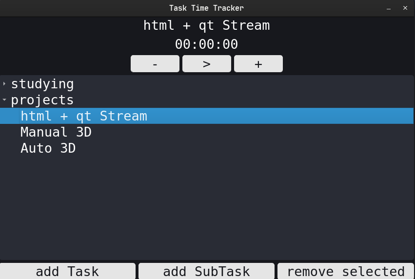

# Task Time Tracker

Task Time Tracker is a simple Qt project aimed at helping users track the time spent on various tasks.

## Features

- **Task Management**: Create, edit, and delete tasks easily.
- **Time Tracking**: Track the time spent on each task accurately.
- **User-Friendly Interface**: Intuitive UI design for smooth navigation and usage.
- **Data Persistence**: Tasks and time tracking data are saved for future reference.
- **Customizable**: Customize task names and categories for better organization.

## Screenshots


*Main UI of the Task Time Tracker*

## Installation

To run the Task Time Tracker project, follow these steps:

1. Clone the repository to your local machine.
```bash
   git clone https://github.com/MarwanMagdy0/Task-Time-Tracker.git
```

2. run the project.
```bash
   python3 main.py
```

## Usage

- **Adding Tasks**: Click on the "add Task" button to add a new task. Enter the task name and select a category if needed.
- **Editing Tasks**: Double-click on a task to edit its details.
- **Deleting Tasks**: Click on the "remove selected" button on a task.
- **Tracking Time**: Click on the play button to start tracking time. Click again to pause.

## TODOS
- **Viewing Reports**: Use the report feature to view time spent on tasks over a specific period.


## Dependencies

- Qt Framework

## Contributing

Contributions are welcome! If you find any bugs or have suggestions for improvements, please open an issue or submit a pull request.

## License

This project is licensed under the [MIT License](LICENSE).
